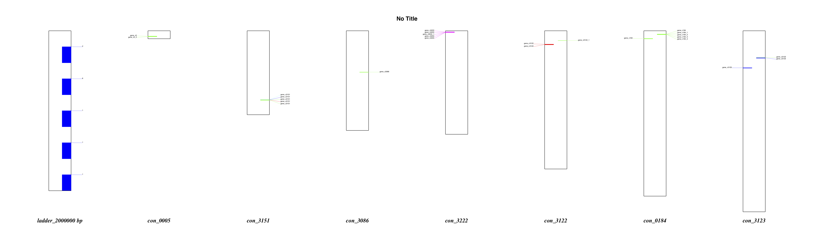

# GeneHere; Gene position visulizer for GFF3 

====

GeneHere visualizes the gene position from gff3 and fasta format files. 

## Example

```

```


## Requirement
Python 3.7. (Biopython, pandas, argparse)

## Usage
```sh
usage: genehere.py [-h] -f FASTA -g GFF [-t TITLE] [-o OUT] [-s SCALE]
                   [-S SCALE_SPLIT] [-x XSIZE] [-y YSIZE]

optional arguments:
  -h, --help            show this help message and exit
  -f FASTA, --fasta FASTA
                        File path to a fasta file
  -g GFF, --gff GFF     GFF3 file path
  -t TITLE, --title TITLE
                        Figure title (default = No Title)
  -o OUT, --out OUT     Output file (pdf) name (default = simple_chrom.pdf)
  -s SCALE, --scale SCALE
                        Manualy set the ladder scale size (default = 100000)
  -S SCALE_SPLIT, --scale_split SCALE_SPLIT
                        How many split ladder (default = 10)
  -x XSIZE, --xsize XSIZE
                        output image file size (x axis, default = 100 [cm] )
  -y YSIZE, --ysize YSIZE
                        output image file size (y axis, default = 30 [cm] )

```

## Demo
```sh
cd example
../genehere.py -f genome.fa -g gene.gff3 -s 2000000

```
